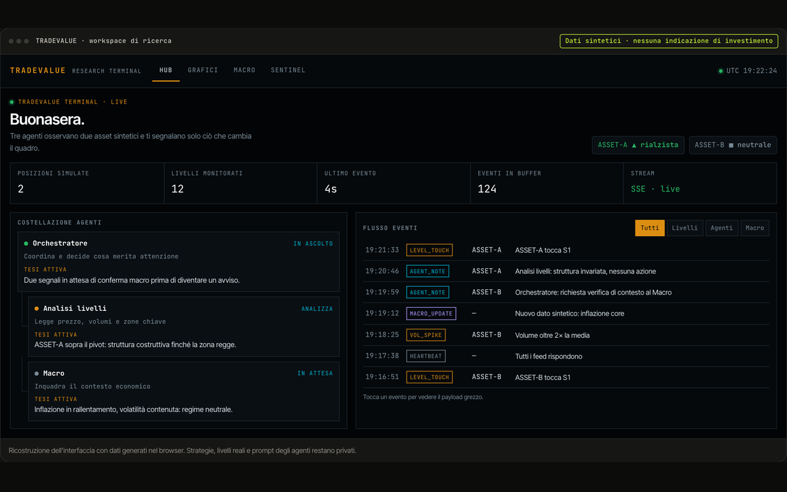

# TRADEVALUE

> Un terminale di ricerca sui mercati: agenti specializzati leggono prezzi e macroeconomia, e un sistema di sicurezza resta sempre acceso.

`06` · **Progetto personale · mercati** · 2026 · Ideazione e sviluppo

[**▶ Prova la demo**](https://portfolio.lele-tradevalue.com/progetti/tradevalue/#demo) · [Caso studio completo](https://portfolio.lele-tradevalue.com/progetti/tradevalue/) · [English version](https://portfolio.lele-tradevalue.com/en/progetti/tradevalue/)

## Il problema

Seguire i mercati vuol dire incrociare grafici, livelli di prezzo, dati macro e notizie, e ricordarsi perché si è presa una decisione. Le piattaforme danno i dati, non il ragionamento, e quasi mai aiutano a capire dopo cosa ha funzionato.

## Cosa ho costruito

TRADEVALUE è il mio workspace di analisi. Un orchestratore coordina agenti che studiano livelli di prezzo e quadro macro, scrivono tesi motivate e avvisano su Telegram. Una dashboard in stile terminale mostra grafici, eventi in diretta, indicatori macroeconomici e un registro delle operazioni simulate. Un modulo sentinella può fermare tutto con un interruttore, e una sezione di calibrazione confronta la fiducia dichiarata con i risultati.

## Come funziona

1. **Dati in streaming** — Prezzi, livelli e indicatori macro arrivano in tempo reale.
2. **Agenti con un compito** — Ognuno produce una tesi con le sue motivazioni, non un segnale secco.
3. **Sicurezza prima di tutto** — Sentinella con interruttore per ogni asset e registro di audit.
4. **Memoria e verifica** — Post-mortem e calibrazione misurano quanto le previsioni erano affidabili.

## Perché funziona

- **Ragionamento esplicito.** Ogni tesi è leggibile e confrontabile nel tempo.
- **Un interruttore sempre a portata.** Il blocco è deterministico e non dipende dal modello.
- **Imparare dagli errori.** I post-mortem confrontano ciò che è successo con le alternative.
- **Densità da terminale.** Molta informazione, leggibile, con numeri tabulari e scorciatoie.

## In numeri

| | |
|---:|---|
| **3** | agenti coordinati |
| **4** | timeframe sui grafici |
| **10+** | indicatori macro |
| **1** | kill switch per asset |

## Stack

`Python` `FastAPI` `React` `TypeScript` `SSE` `SQLite`

## Cosa resta privato

Strategie, livelli, prompt e risultati sono privati. La demo usa asset fittizi e dati sintetici: nessuna indicazione di investimento. Questo repository contiene solo la presentazione del progetto: niente codice sorgente, cronologia o configurazioni.

<b>In English</b>

**TRADEVALUE** — A market research terminal: specialised agents read prices and macro data, and a safety system is always on.

TRADEVALUE is my analysis workspace. An orchestrator coordinates agents that study price levels and the macro picture, write reasoned theses and send alerts on Telegram. A terminal-style dashboard shows charts, live events, macro indicators and a log of simulated trades. A sentinel module can halt everything with a switch, and a calibration view compares stated confidence with outcomes.

- **Explicit reasoning.** Every thesis is readable and comparable over time.
- **A switch always within reach.** The halt is deterministic and does not depend on the model.
- **Learning from mistakes.** Post-mortems compare what happened with the alternatives.
- **Terminal density.** Lots of information, readable, with tabular numbers and shortcuts.

[Read the full case study and try the demo →](https://portfolio.lele-tradevalue.com/en/progetti/tradevalue/)

---

Emanuele Montalto · [portfolio](https://portfolio.lele-tradevalue.com) · [LinkedIn](https://www.linkedin.com/in/emanuele-montalto/) · [montalto36@gmail.com](mailto:montalto36@gmail.com)
